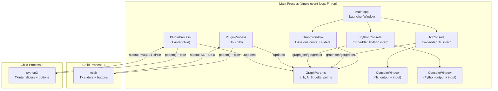
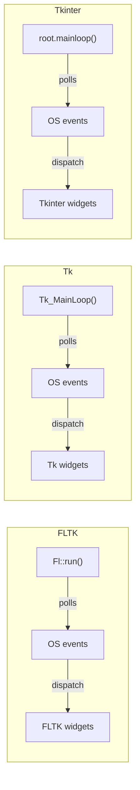
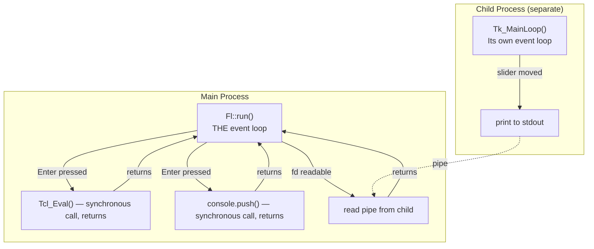
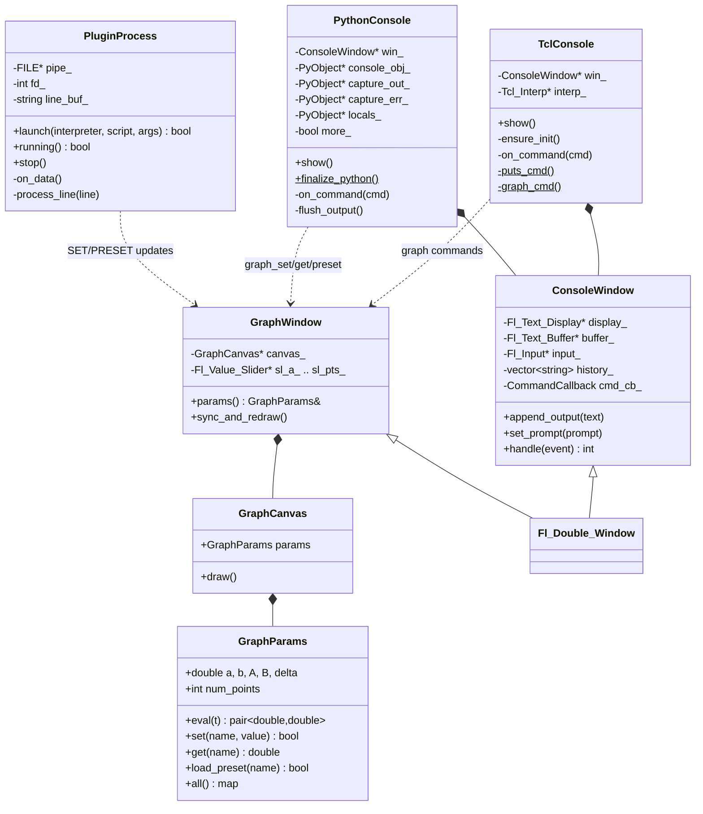
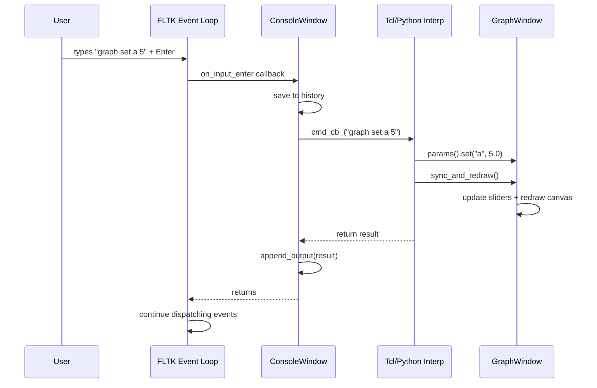
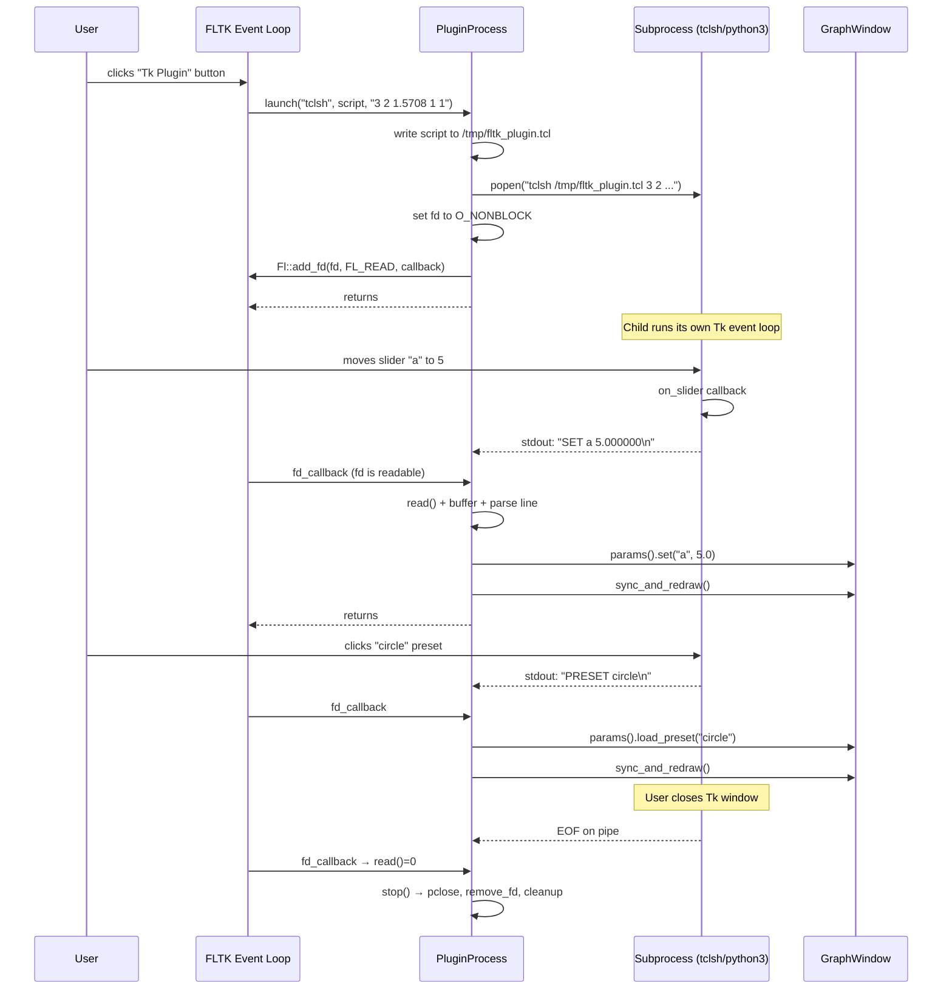
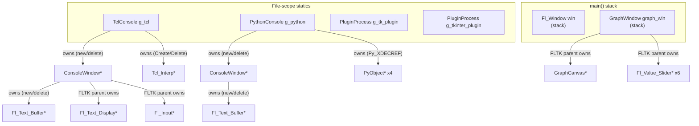

# FLTK Console — Architecture & Design

An educational C++17 application demonstrating how to embed **Tcl** and **Python**
interpreters inside an **FLTK** GUI, and how to safely launch **Tcl/Tk** and
**Python/Tkinter** plugin windows as subprocesses — all without event-loop conflicts.

---

## Table of Contents

1. [Project Overview](#project-overview)
2. [High-Level Architecture](#high-level-architecture)
3. [The Event Loop Problem](#the-event-loop-problem)
4. [Component Map](#component-map)
5. [Data Flow](#data-flow)
6. [Plugin Communication Protocol](#plugin-communication-protocol)
7. [Memory & Lifetime Management](#memory--lifetime-management)
8. [Build & Run](#build--run)

---

## Project Overview

This project answers a common question in desktop application development:

> *How do I combine FLTK, Tcl, Python, Tk, and Tkinter in a single application
> without their event loops fighting each other?*

The answer: **embed the interpreters, isolate the GUIs**.

```
 ┌─────────────────────────────────────────────────────────┐
 │                    FLTK Application                     │
 │                                                         │
 │  ┌──────────────┐  ┌───────────────┐  ┌─────────────┐  │
 │  │ Tcl Console  │  │Python Console │  │ Graph Window│  │
 │  │ (embedded    │  │(embedded      │  │ (FLTK       │  │
 │  │  interpreter)│  │ interpreter)  │  │  drawing)   │  │
 │  └──────────────┘  └───────────────┘  └──────┬──────┘  │
 │                                              │         │
 │         ┌────────────────────────────────────┘         │
 │         │  parameters (a, b, A, B, delta)              │
 │         ▼                                              │
 │  ┌──────────────────────────────────────────────────┐  │
 │  │              Fl::add_fd() pipe reader             │  │
 │  └──────────┬──────────────────────┬────────────────┘  │
 │             │ stdout               │ stdout            │
 └─────────────┼──────────────────────┼───────────────────┘
               │                      │
        ┌──────┴──────┐        ┌──────┴──────┐
        │  Subprocess │        │  Subprocess │
        │  tclsh +Tk  │        │ python3     │
        │  (own event │        │ +tkinter    │
        │   loop)     │        │ (own event  │
        └─────────────┘        │  loop)      │
                               └─────────────┘
```

### What each piece does

| Component | In-process? | Has event loop? | Purpose |
|-----------|:-----------:|:---------------:|---------|
| FLTK GUI | Yes | **Yes** — `Fl::run()` | Main window, console windows, graph canvas |
| Tcl interpreter | Yes (embedded) | No | Execute Tcl commands synchronously |
| Python interpreter | Yes (embedded) | No | Execute Python commands synchronously |
| Tk plugin | **No** (subprocess) | **Yes** — Tk `MainLoop` | Slider GUI that sends params to parent |
| Tkinter plugin | **No** (subprocess) | **Yes** — `mainloop()` | Same, in Python |

---

## High-Level Architecture



---

## The Event Loop Problem

This is the central design challenge. Every GUI toolkit has an event loop that
**blocks** waiting for input events and dispatches them to widgets:



**If you run two event loops in the same thread**, one blocks the other:

```
 Thread ──▶ Fl::run() blocks forever
                │
                ╳  Tk_MainLoop() never gets to run
                ╳  tkinter.mainloop() never gets to run
```

### The Solution

```
 ┌──────────────────────────────────────────────────────────────┐
 │  RULE: One event loop per process, one process per event     │
 │        loop. If you need a second GUI toolkit, use a          │
 │        subprocess.                                            │
 └──────────────────────────────────────────────────────────────┘
```



Key points:
- **Embedding an interpreter ≠ running its event loop.** `Tcl_Eval()` and
  `InteractiveConsole.push()` are plain function calls. They execute, return a
  result, and FLTK resumes.
- **Fl::add_fd()** integrates pipe I/O into FLTK's event loop. When the child
  process writes to stdout, FLTK wakes up and calls our handler — no threads,
  no polling loops.

---

## Component Map



### Source File Map

```
src/
├── main.cpp              Entry point, launcher window, button callbacks
├── console_window.h/cpp  Reusable FLTK console widget (display + input + history)
├── tcl_console.h/cpp     Embedded Tcl interpreter + custom commands
├── python_console.h/cpp  Embedded Python interpreter + C-extension functions
├── graph_params.h/cpp    Pure C++ parametric curve math (no GUI dependency)
├── graph_window.h/cpp    FLTK graph canvas + slider panel
└── plugin_process.h/cpp  Subprocess launcher + pipe reader + embedded scripts

tests/
└── test_interpreters.cpp Headless tests for Tcl, Python, and GraphParams
```

---

## Data Flow

### Console Command Flow



### Plugin Subprocess Flow



---

## Plugin Communication Protocol

The plugins communicate with the parent process through a simple text protocol
over stdout:

```
 ┌──────────────────────────────────────────────────────┐
 │  PROTOCOL: one command per line, flushed immediately │
 │                                                       │
 │  SET <param> <value>    Set a single parameter        │
 │  PRESET <name>          Load a named preset           │
 │                                                       │
 │  Examples:                                            │
 │    SET a 5.000000                                     │
 │    SET delta 1.570796                                 │
 │    PRESET circle                                      │
 │    PRESET figure8                                     │
 └──────────────────────────────────────────────────────┘

 Valid parameters:  a, b, A, B, delta
 Valid presets:     circle, figure8, lissajous, star, bowtie
```

The parent reads lines via `Fl::add_fd()` and parses them with `sscanf`:

```
Child stdout ──▶ pipe ──▶ Fl::add_fd(fd, FL_READ) ──▶ on_data()
                                                          │
                                    ┌─────────────────────┘
                                    ▼
                              line_buf_ accumulates bytes
                                    │
                                    ▼ (on '\n')
                              process_line()
                                    │
                          ┌─────────┴─────────┐
                          ▼                   ▼
                    "SET a 5.0"         "PRESET circle"
                          │                   │
                          ▼                   ▼
                  gw->params().set()   gw->params().load_preset()
                          │                   │
                          └─────────┬─────────┘
                                    ▼
                          gw->sync_and_redraw()
```

---

## Memory & Lifetime Management

### Object Ownership



### Key Rules

```
 ┌──────────────────────────────────────────────────────────────┐
 │  FLTK OWNERSHIP RULE                                         │
 │  Widgets created between begin()/end() are owned by the      │
 │  parent window. The parent deletes them. Do NOT delete them   │
 │  yourself.                                                    │
 │                                                               │
 │  EXCEPTION: Fl_Text_Buffer is NOT owned by Fl_Text_Display.  │
 │  You must delete it yourself.                                 │
 └──────────────────────────────────────────────────────────────┘

 ┌──────────────────────────────────────────────────────────────┐
 │  PYTHON REFCOUNT RULE                                        │
 │  PyDict_SetItemString() does NOT steal references.           │
 │  PyTuple_SetItem() DOES steal references.                    │
 │  Always check the docs for each API call.                    │
 │                                                               │
 │  Use Py_DECREF for every PyObject* you create.               │
 │  Use Py_XDECREF when the pointer might be NULL.              │
 └──────────────────────────────────────────────────────────────┘

 ┌──────────────────────────────────────────────────────────────┐
 │  TCL INTERP RULE                                             │
 │  Tcl_CreateInterp() → Tcl_DeleteInterp() in destructor.     │
 │  String results from Tcl_GetStringResult() are valid only    │
 │  until the next Tcl_Eval() call.                             │
 └──────────────────────────────────────────────────────────────┘
```

### Destruction Order

```
main() returns
    │
    ▼ (stack unwinds)
    graph_win destroyed  ← FLTK window + children freed
    win destroyed        ← launcher window freed
    │
    ▼ (static destructors, reverse order of construction)
    g_python destroyed   ← XDECREF no-ops (already null), delete ConsoleWindow
    g_tcl destroyed      ← Tcl_DeleteInterp, delete ConsoleWindow
    g_tkinter_plugin destroyed ← pclose pipe, remove temp file
    g_tk_plugin destroyed      ← pclose pipe, remove temp file
```

> **Note:** `PythonConsole::finalize_python()` is called before `main()`
> returns, while `g_python`'s destructor runs after. To handle this safely,
> `main()` calls `g_python.release_python_objects()` *before*
> `finalize_python()`, releasing all Python refs while the interpreter is
> still alive. The destructor's subsequent `Py_XDECREF` calls see null
> pointers and become no-ops. See
> [Lessons Learned](#lessons-learned-bugs-that-were-found-and-fixed) below.

---

## Infographic: How Everything Connects

```
╔══════════════════════════════════════════════════════════════════════════╗
║                    FLTK + Tcl + Python Application                     ║
║                         Architecture Overview                          ║
╠══════════════════════════════════════════════════════════════════════════╣
║                                                                        ║
║   ┌─────────────────── MAIN PROCESS ──────────────────────────────┐    ║
║   │                                                               │    ║
║   │   EVENT LOOP: Fl::run()                                       │    ║
║   │   ════════════════════                                        │    ║
║   │   Handles ALL events: mouse, keyboard, timers, pipe I/O      │    ║
║   │                                                               │    ║
║   │   ┌─────────────┐  ┌──────────────┐  ┌──────────────────┐    │    ║
║   │   │  Launcher   │  │ Tcl Console  │  │ Python Console   │    │    ║
║   │   │  Window     │  │              │  │                  │    │    ║
║   │   │ ┌─────────┐ │  │ ┌──────────┐ │  │ ┌──────────┐     │    │    ║
║   │   │ │Tcl Cons.│─┼──▶│Tcl_Eval()│ │  │ │.push()   │     │    │    ║
║   │   │ │Py Cons. │─┼──────────────────▶│ │(sync)    │     │    │    ║
║   │   │ │Graph    │─┼──┐│ (sync)    │ │  │ └────┬─────┘     │    │    ║
║   │   │ │Tk Plug. │─┼─┐││ └────┬─────┘ │  │      │           │    │    ║
║   │   │ │Tkinter  │─┼┐│││      │       │  │      │           │    │    ║
║   │   │ └─────────┘ ││││└──────┼───────┘  └──────┼──────────┘    │    ║
║   │   └─────────────┘││││      │                  │               │    ║
║   │                  ││││      │    ┌─────────────┘               │    ║
║   │              ┌───┘│││      │    │                             │    ║
║   │              │    │││      ▼    ▼                             │    ║
║   │              │    │││  ┌────────────────────────────────┐     │    ║
║   │              │    │││  │  GraphWindow                   │     │    ║
║   │              ▼    │││  │  ┌─────────────┐ ┌──────────┐ │     │    ║
║   │   ┌──────────────┐│││  │  │ GraphCanvas │ │ Sliders  │ │     │    ║
║   │   │ GraphParams  │◀┼┼──│  │ (draw curve)│ │ a,b,δ,   │ │     │    ║
║   │   │ a=3 b=2 δ=π/2│││  │  │             │ │ A,B,pts  │ │     │    ║
║   │   │ A=1 B=1 pts= ││││  │  └─────────────┘ └──────────┘ │     │    ║
║   │   │         1000 ││││  └────────────────────────────────┘     │    ║
║   │   └──────────────┘│││                                        │    ║
║   │         ▲         │││                                        │    ║
║   │         │         │││                                        │    ║
║   │    ┌────┴────┐    │││                                        │    ║
║   │    │ Fl::    │    │││                                        │    ║
║   │    │ add_fd()│◀───┼┼┼────── pipe stdout ──────────────┐     │    ║
║   │    └─────────┘    │││                                 │     │    ║
║   └───────────────────┼┼┼─────────────────────────────────┼─────┘    ║
║                       │││                                 │          ║
║          ┌────────────┘│└────────────┐                    │          ║
║          │             │             │                    │          ║
║          ▼             ▼             ▼                    │          ║
║   ┌─────────────┐  ┌──────────┐  ┌──────────────────┐    │          ║
║   │ SUBPROCESS  │  │SUBPROCESS│  │ SUBPROCESS        │    │          ║
║   │             │  │          │  │                    │    │          ║
║   │ tclsh       │  │ python3  │  │ "SET a 5.0"  ─────┼────┘          ║
║   │ + Tk GUI    │  │+tkinter  │  │ "PRESET circle"───┘              ║
║   │             │  │  GUI     │  │                    │              ║
║   │ Tk_MainLoop │  │mainloop()│  │ (each has its own  │              ║
║   │ (own loop)  │  │(own loop)│  │  event loop)       │              ║
║   └─────────────┘  └──────────┘  └──────────────────┘               ║
║                                                                      ║
╠══════════════════════════════════════════════════════════════════════╣
║  KEY INSIGHT: Tcl_Eval() and console.push() are FUNCTION CALLS,     ║
║  not event loops. They execute and return. Only Tk and Tkinter       ║
║  need their own event loop — so they run in subprocesses.            ║
╚══════════════════════════════════════════════════════════════════════╝
```

---

## Lessons Learned: Bugs That Were Found and Fixed

During code review, three bugs were identified and fixed. They are documented
here because each one teaches an important C/C++ API concept.

### 1. PyFloat refcount leak in `py_graph_params`

**What went wrong:** `PyDict_SetItemString` does **not** steal the reference.
Passing `PyFloat_FromDouble(v)` directly as an argument creates a new ref
(refcount=1), then `SetItemString` increments it (refcount=2). When the dict is
eventually freed, refcount drops to 1 — the float is never deallocated.

```cpp
// BEFORE (leaked one PyFloat per parameter per call):
for (auto& [k, v] : all)
    PyDict_SetItemString(dict, k.c_str(), PyFloat_FromDouble(v));

// AFTER (correctly releases the temporary ref):
for (auto& [k, v] : all) {
    PyObject* fval = PyFloat_FromDouble(v);
    PyDict_SetItemString(dict, k.c_str(), fval);
    Py_DECREF(fval);
}
```

**Takeaway:** Always check whether a Python C API function *steals* or
*borrows* a reference. `PyDict_SetItemString` borrows (increments refcount);
`PyTuple_SetItem` steals (does not increment). When in doubt, consult the
[Python C API docs](https://docs.python.org/3/c-api/).

### 2. Py_XDECREF after Py_FinalizeEx

**What went wrong:** `g_python` is a file-scope static. Its destructor runs
*after* `main()` returns, but `Py_FinalizeEx()` was called inside `main()`.
The destructor's `Py_XDECREF` calls operated on a dead interpreter — undefined
behavior.

**Fix:** A new `release_python_objects()` method DECREFs all four `PyObject*`
pointers and nulls them. `main()` now calls it *before* `Py_FinalizeEx()`.
The destructor calls the same method, but since the pointers are already null,
the `Py_XDECREF` calls become harmless no-ops.

```cpp
// main.cpp — correct shutdown order:
g_python.release_python_objects();   // refs released while Python is alive
PythonConsole::finalize_python();    // now safe to tear down the interpreter
```

**Takeaway:** With embedded interpreters, destruction order matters. Release
all interpreter-managed resources *before* finalizing the interpreter. Design
your cleanup methods to be idempotent (safe to call twice).

### 3. Missing EAGAIN handling in non-blocking read

**What went wrong:** `PluginProcess::on_data()` sets the pipe fd to
`O_NONBLOCK`, but treated all negative `read()` returns as EOF. With
non-blocking I/O, `read()` returns -1 with `errno == EAGAIN` when no data is
available — this is not an error, just a spurious wakeup.

```cpp
// BEFORE (spurious wakeup would kill the plugin):
ssize_t n = read(fd_, buf, sizeof(buf) - 1);
if (n <= 0) { stop(); return; }

// AFTER (EAGAIN is handled correctly):
ssize_t n = read(fd_, buf, sizeof(buf) - 1);
if (n < 0 && (errno == EAGAIN || errno == EWOULDBLOCK)) return;
if (n <= 0) { stop(); return; }
```

**Takeaway:** Non-blocking I/O requires checking `errno` when `read()` returns
-1. `EAGAIN`/`EWOULDBLOCK` mean "try again later", not "the pipe is broken".
This is easy to miss because `Fl::add_fd` usually only fires when data is
actually available, making the bug rare but real.

---

## Build & Run

### Prerequisites (macOS with Homebrew)

```bash
brew install fltk tcl-tk python@3
```

### Build

```bash
mkdir build && cd build
cmake ..
make
```

### Run

```bash
./fltk_console     # launches the main window
```

### Test

```bash
cd build
ctest --output-on-failure
# or directly:
./test_interpreters
```
